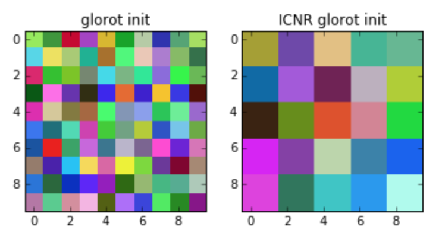

# Checkerboard artifact free sub pixel convolution initialization
Tensorflow implementation of ICNR initialization used in https://arxiv.org/pdf/1707.02937.pdf



## Usage example:

Wrap up your initialization with ICRN and you are ready to go:
```python
slim.conv2d(... weights_initializer=ICNR(tf.glorot_uniform_initializer(), scale=2))
```

